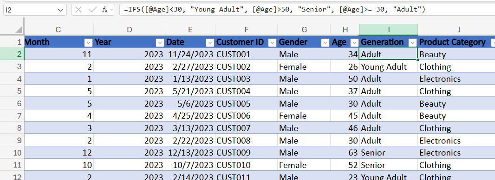
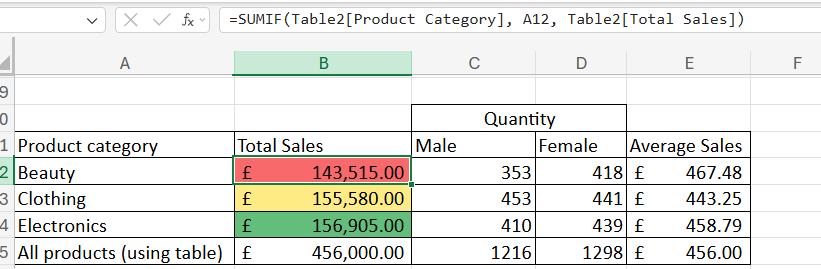
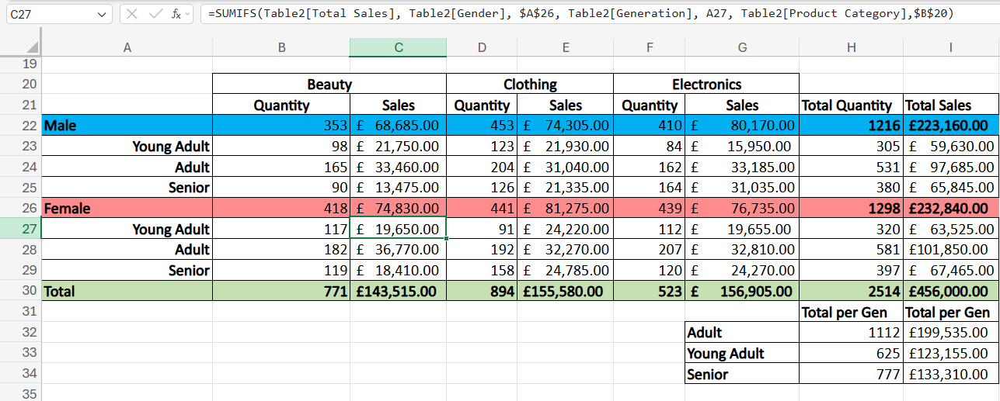
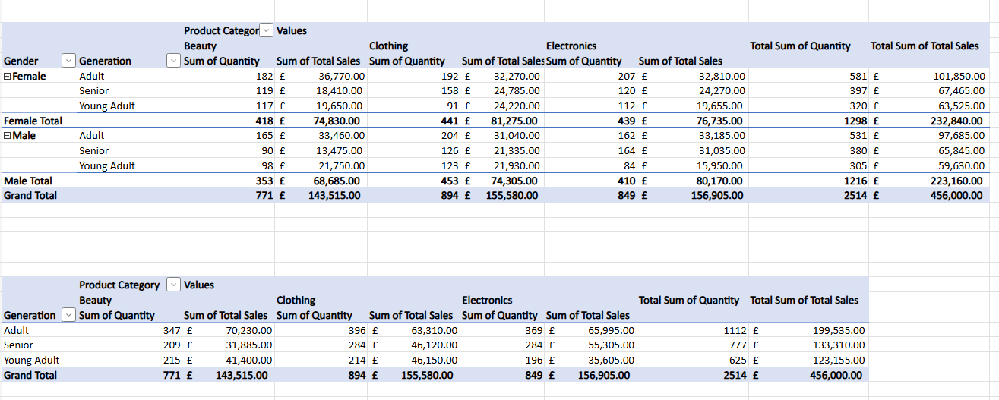
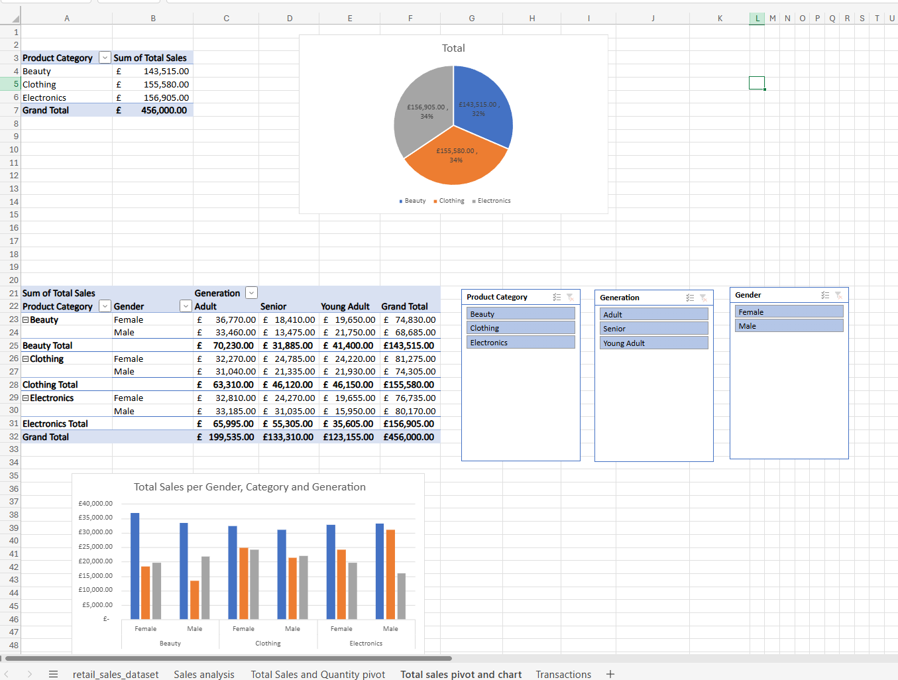
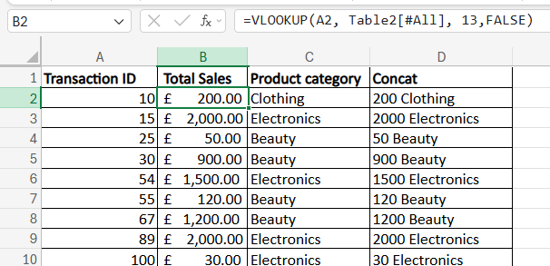

# Retail Sales Dataset Analysis

## Project Overview
This project used Excel to prepare, analyse and visualise a retail sales dataset. 

## Skills Demonstrated
- Date functions
- Logical functions and calculations (IF, IFS, SUMIFS, AVERAGEIF)
- Lookup functions (VLOOKUP)
- Pivot Tables
- Pivot Charts
- Slicers
- Conditional Formatting

## Dataset
The raw dataset can be found in `retail_sales_dataset_raw.xlsx`

The analysis of the data set can be found in `retail_sales_dataset_analysis.xlsx`

## Data Preparation

### Duplicate checks
The dataset was checked for duplicate records before analysis.

### Data Transformation
Year values were extracted from transaction dates, allowing for the calculation of year-specific commissions.

### Generation Classification
Customers were categorised into age groups (Young Adult, Adult and Senior) using an IFS function.

## Analysis and Reporting

Using UNIQUE, identified each individual category. SUMIF(S) were then used to summarise total sales as well as quantity separated by gender.

### Sales Summary Analysis

To gain further insights, the data was broken down further. Using SUMIFS, total sales and quantities were analysed by:
- Gender
- Generation
- Product Category

### Pivot Table Analysis

A pivot table was created to summarise the same sales and quantities metrics.

### Interactive Sales Analysis Report

Pivot tables, pivot charts and slicers were used to create an interactive sales report analysing generations, genders and categories.

### Transaction Analysis

VLOOKUP and CONCAT were used to retrieve transaction information and combine data into a readable format.

## Business Value
 
This analysis highlights purchasing trends across different demographics and product categories.
 
The findings could help businesses identify their strongest customer segments, tailor marketing strategies to specific audiences, and target underperforming demographics with promotions or new product offerings.

